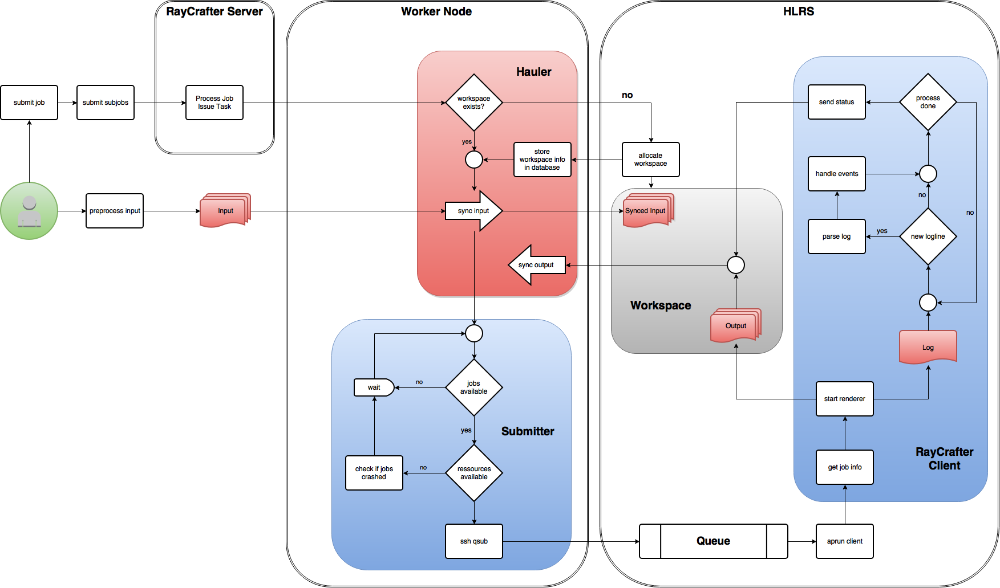

.. _workflow:

========
Workflow
========

This section describes process involved in rendering on the cluster.

- It starts with the user submitting a job. This can be done via the REST API.
  The job has a name and acts as a group for subjobs
- Subjobs are the actual jobs that will later get queued on the cluster.
  A subjob might be a single frame, while a job might bundle a whole framerange.
  A subjob explicitly describes what the renderer should do (for example
  which input file to use).

.. Note:: My first thought was to only submit a job, which roughly describes a renderjob,
          and that the server automatically creates the subjobs.
          This might seem convenient but the server needs a lot more logic and information.
          E.g. your input files might be distributed over several directories or all in the
          same place. The server would need to know a lot about the pipeline.
          The problem is, that the server might not be able to scan a directory, because
          he doesn't even have access. So the explicit approach enables the Hauler to
          live on a different server which actually has access to the filesystem and
          can transfer data via :ref:`gridftp` or something similar.
  
Hauler:

- Now the input data has to be transferred to the cluster.
  The job info also contains a workspace name. If the workspace does not yet exist,
  it is created. This has to be done via ssh. The command is ``ws_allocate``.
- We store the information about the workspace in the database. This way, we do not have
  to check every time and can issue a warning if a workspace runs out of time.
- Now the input can finally be synced. :ref:`gridftp` can be used as a
  high-performance protocol.

Submitter:

- The submitter runs in a loop. First it checks for any available jobs.
  A job is available after the input got synced.
- Next the ressources have to be checked. Ressources might be things like
  licences or queue size. The ressources are kept track of in the database.
- If no ressources are available, we should check if any jobs have crashed.
  In that case they might have not freed their ressources.
- If a job is available with all necessary ressources, then it will
  get submitted. See :ref:`scheduling` for more information.
  The job will be placed in a queue until a MOM node on the cluster
  will execute the job script. The jobscript simply launches the
  RayCrafter client.

RayCrafter client:

- The client will retrieve the job info from the database.
- Based on the information it will run the renderer.
- The renderer creates two types of outputs. The rendered data,
  e.g. images and a logfile.
- The logs get parsed and sent to the logging server.
  Parsing the log might create an event. For example the renderer
  logs an error. This will create an event. Based on the event,
  the client could decide to abort the renderer or restart it.
- Between parsing the log, the process gets polled. When the
  process finishes, the status in the database gets updated.
- This will trigger the Hauler to sync the output.
